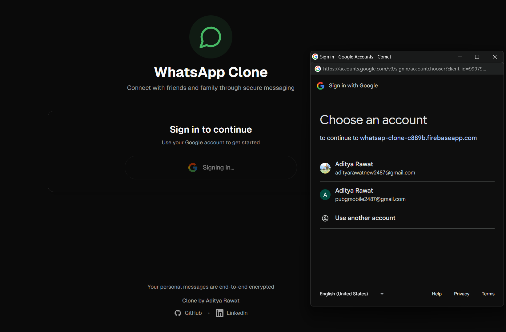
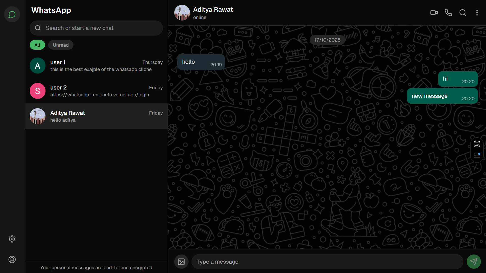

# WhatsApp Clone X Firebase

> Visit Live link <a href="https://whatsapp-ten-theta.vercel.app/" target="_blank">WhatsApp Clone</a> .

## About this project

> I cloned WhatsApp, but the interesting part is that I didn’t use `Socket.io` like others. Instead, I used the `Firebase Realtime Database` to bring this project to life.

# Authentication

> I used firebase authenction for the Google Authentication.

# Chat Section

> Chat latency less than ~200ms.